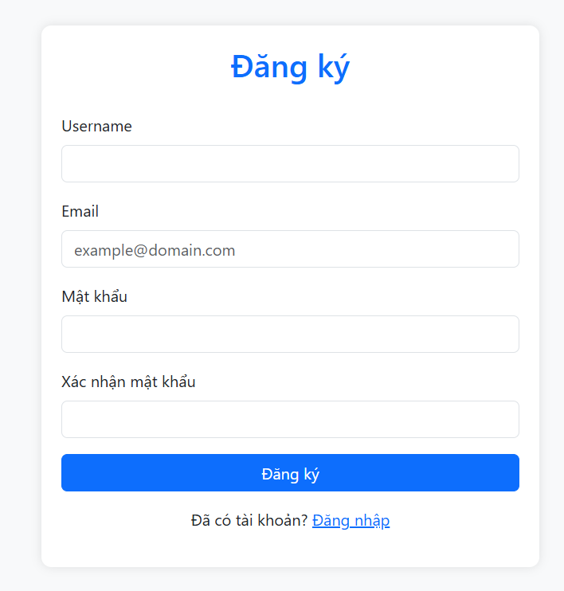
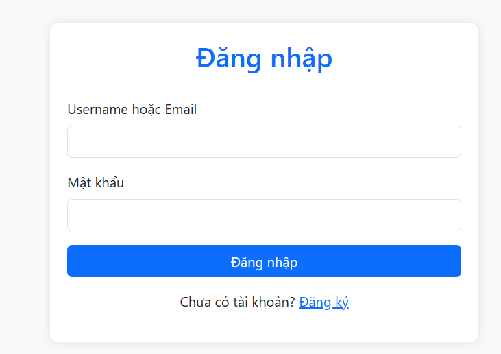

# Project: Flash-tiny-app

## Danh sách thành viên:

1. **Phạm Gia Kiệt** - 22662391
2. **Phạm Văn Mạnh** - 22642071

---

## Nội dung phiên bản 2:

Ở phần này, nhóm tập trung vào việc làm trang **đăng ký** và **đăng nhập**. Nhóm cũng sử dụng **Bootstrap** để giúp cho việc xây dựng giao diện trở nên đơn giản hơn.

### 1. Trang Đăng Ký

Trang đăng ký gồm **4 trường** mà người dùng cần nhập:

- **Username**: Tên sẽ hiển thị trên trang blog. Trường này có thể trùng tên giữa nhiều người dùng.
- **Email**: Email hiện tại của người dùng.
- **Mật khẩu**: Không giới hạn số ký tự.
- **Xác nhận mật khẩu**: Người dùng nhập lại mật khẩu để kiểm tra.

Sau khi đăng ký, hệ thống sẽ kiểm tra xem **"Mật khẩu"** và **"Xác nhận mật khẩu"** có trùng nhau không:

- Nếu **không trùng**, hiển thị thông báo lỗi.
- Nếu **trùng**, lưu thông tin vào **MongoDB**.

Nếu người dùng đã có tài khoản, họ có thể nhấn vào **liên kết đăng nhập** ở dưới cùng để vào trang đăng nhập.

#### Hình ảnh trang đăng ký:

---

### 2. Trang Đăng Nhập

Trang đăng nhập gồm **2 trường** mà người dùng cần nhập:

- **Username**: Tên người dùng.
- **Password**: Mật khẩu.

Sau khi nhấn đăng nhập, hệ thống sẽ kiểm tra mật khẩu nhập vào và mật khẩu lưu trong **database**:

- Nếu **khớp**, hiển thị thông báo **"Đăng nhập thành công"** và tạo **cookie** chứa tên người dùng để thuận tiện cho các thao tác tiếp theo.
- Nếu **không khớp**, hiển thị thông báo lỗi và yêu cầu nhập lại.

Nếu người dùng chưa có tài khoản, họ có thể nhấn vào **liên kết đăng ký** ở dưới cùng để tạo tài khoản mới.

#### Hình ảnh trang đăng nhập:

