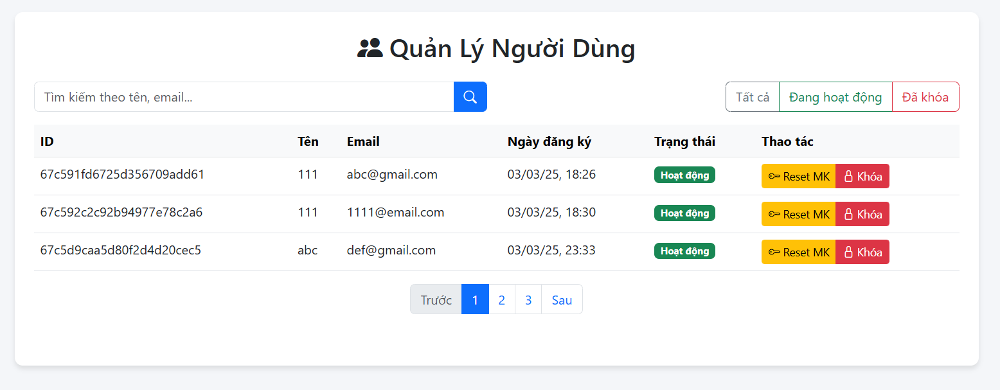
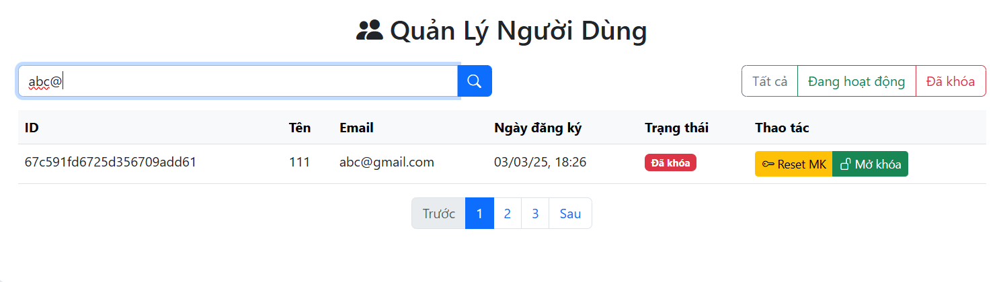

# Project: Flash-tiny-app

## Danh sách thành viên:
1. **Phạm Gia Kiệt** - 22662391  
2. **Phạm Văn Mạnh** - 22642071  

---

## Nội dung phiên bản 3:

Sau khi hoàn thành phần **đăng ký/đăng nhập**, ở phiên bản này, nhóm tiếp tục phát triển **trang Admin** để quản lý người dùng.  

### Giao diện chính của trang Admin:
  

Trang này chứa một **bảng quản lý người dùng** với các thông tin:  
- **ID**: ID trong database  
- **Tên**: Username của người dùng  
- **Email**: Email của người dùng  
- **Ngày đăng ký**: Thời gian tài khoản được tạo  
- **Trạng thái**:  
  - **Hoạt động**: Nếu trường `block` trong MongoDB là `false`  
  - **Vô hiệu hóa**: Nếu trường `block` là `true`  
- **Thao tác**:  
  - **Reset MK** (đặt lại mật khẩu)  
  - **Khóa** (chặn tài khoản)  

---

## Reset mật khẩu:
- Khi admin nhấn **Reset MK**, một **modal xác nhận** sẽ xuất hiện.  
- Nếu nhấn **Xác nhận**:  
  - Mật khẩu người dùng sẽ được đặt lại thành **"123456"**  
  - **Cookie username sẽ bị xóa**  
  - Hiển thị thông báo **"Mật khẩu đã reset thành công!"**  
- **Ở phía người dùng:**  
  - Nếu đang đăng nhập, họ sẽ bị **đăng xuất** ngay lập tức  
  - Khi nhập mật khẩu cũ → Nhận thông báo **"Mật khẩu đã bị reset!"**  
  - Hệ thống chuyển hướng họ đến **trang đặt lại mật khẩu**  
  - Người dùng nhập mật khẩu mới, xác nhận, lưu lại → **Đăng nhập lại**  

---

## Khóa tài khoản:
- Khi admin nhấn **Khóa**, một **modal xác nhận** sẽ xuất hiện.  
- Nếu admin nhấn **Xác nhận**:  
  - Tài khoản sẽ được **chuyển sang trạng thái "Vô hiệu hóa"** (Đỏ)  
  - **Nút "Khóa" sẽ đổi thành "Mở khóa"**  
  - **Cookie username sẽ bị xóa**  
  - Hiển thị thông báo **"Tài khoản đã bị khóa!"**  
- **Ở phía người dùng:**  
  - Nếu họ đang đăng nhập → **Bị đăng xuất ngay lập tức**  
  - Khi nhập tài khoản và mật khẩu → Nhận thông báo **"Tài khoản đã bị khóa và không thể đăng nhập!"**  

### Ảnh xác nhận khóa tài khoản:
  

### Ảnh sau khi khóa tài khoản:
  

---

## Các tính năng khác:
### 1. **Tìm kiếm người dùng** theo tên hoặc email  
  

### 2. **Lọc theo trạng thái**  
  
