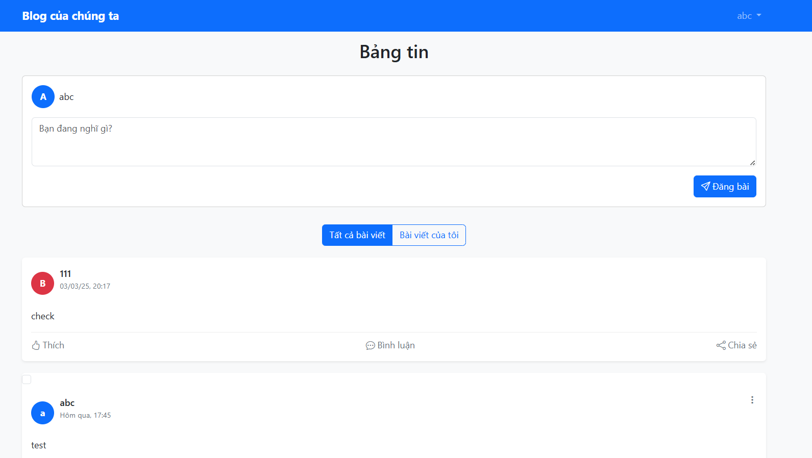
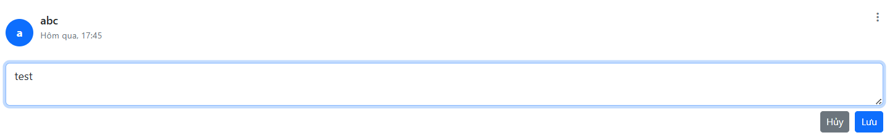
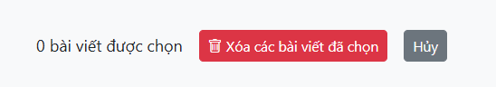

# Project: Flash-tiny-app

## Danh sách thành viên:
1. **Phạm Gia Kiệt** - 22662391  
2. **Phạm Văn Mạnh** - 22642071  

---

## Nội dung phiên bản 4:

Sau khi hoàn thành quản lý user, ở phiên bản này, nhóm tập trung phát triển **chức năng chính của trang web - Blog**.

---

## Giao diện chính:
  

### **Phần Header**
- **Bên trái**: Tên của trang web  
- **Bên phải**: Tên người dùng **(có dropdown)**. Khi nhấp vào, hiển thị một số tùy chọn, trong đó có **Đăng xuất**  

---

## **Tạo bài viết**  
Người dùng có thể tạo bài viết mới.Khi nhấp **"Đăng bài"**, bài viết sẽ xuất hiện ngay trên **đầu trang** và được lưu vào **MongoDB**.  

Trang có **2 tab chính**:  

- **Tất cả bài viết** → Hiển thị tất cả bài post của mọi người  
- **Bài viết của tôi** → Chỉ hiển thị bài viết của người dùng hiện tại  

---

## **1. Quản lý bài viết**

Mỗi bài viết hiển thị **tên người đăng, ngày giờ đăng & nội dung**.  

**Đối với bài viết của mình**, có thêm **nút 3 chấm** chứa 2 chức năng:

### **Chỉnh sửa bài viết**
- Khi chỉnh sửa, hệ thống sẽ hiển thị **thông báo xác nhận**.  
- Sau khi xác nhận, bài viết sẽ được cập nhật.  

**Giao diện chỉnh sửa bài viết:**  
  

### **Xóa bài viết**
- Khi xóa bài viết, sẽ có **thông báo xác nhận** trước khi xóa.  

---

## **2. Xóa nhiều bài viết**

- **Đối với bài viết của chính mình**, sẽ có một **checkbox** ở góc trên bên trái.  
- Người dùng có thể **tick chọn** nhiều bài viết để xóa hàng loạt.  

**Dưới cùng của trang**, sẽ hiển thị số lượng bài viết đã chọn và **2 tùy chọn**:  

- **Xóa tất cả** 🗑️  
- **Hủy chọn** ❌  

**Giao diện xóa nhiều bài viết:**  
  
